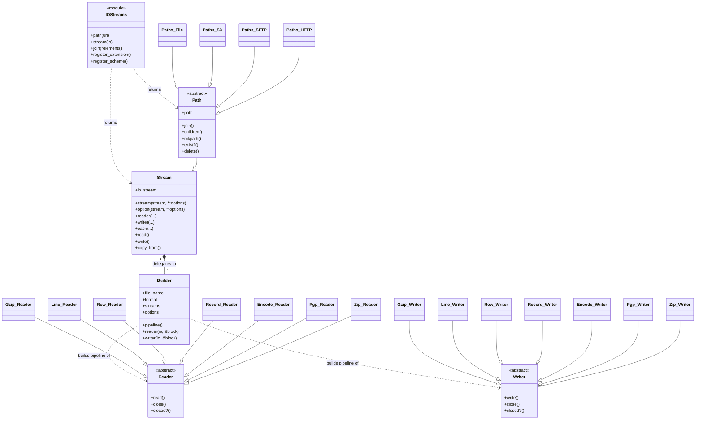

# Contributing

Welcome to IOStreams, great to have you on-board. :tada:

To get you started here are some pointers. 

## Open Source

#### Early Adopters

Great to have you onboard, looking forward to your help and feedback.

#### Late Adopters

IOStreams is open source software, maintained by the author and contributors in their spare time,
around the demands of full-time jobs and other commitments. We genuinely appreciate everyone who
uses the library and takes the time to report issues or suggest improvements.

That said, please keep in mind that we may not be able to prioritize building features for a specific
edge case you have encountered, particularly one that arises in a commercial setting. This is exactly
what Pull Requests are for: if you need a particular enhancement, we warmly encourage you to contribute
it yourself, and we will gladly review it and help get it merged.

## Documentation

Documentation updates are welcome and appreciated by all users of IOStreams.

#### Small changes

For a quick and fairly simple documentation fix the changes can be made entirely online in github.
 
1. Fork the repository in github.
2. Look for the markdown file that matches the documentation page to be updated under the `docs` subdirectory.
3. Click Edit.
4. Make the change and select preview to see what the changes would look like.
5. Save the change with a commit message.
6. Submit a Pull Request back to the IOStreams repository. 

#### Complete Setup

To make multiple changes to the documentation, add new pages or just to have a real preview of what the
documentation would look like locally after any changes.

1. Fork the repository in github.
2. Clone the repository to your local machine.
3. Change into the documentation directory.

       cd iostreams/docs
       
4. Install required gems

       bundle update
       
5. Start the Jekyll server

       jekyll s

6. Open a browser to: http://127.0.0.1:4000

7. Navigate around and find the page to edit. The url usually lines up with the markdown file that
   contains the corresponding text.
   
8. Edit the files ending in `.md` and refresh the page in the web browser to see the change.

9. Once change are complete commit the changes.

10. Push the changes to your forked repository.

11. Submit a Pull Request back to the IOStreams repository. 

## Code Changes

Since changes cannot be made directly to the IOStreams repository, fork it to your own account on Github. 

1. Fork the repository in github.
2. Clone the repository to your local machine.
3. Change into the IOStreams directory.

       cd iostreams
       
4. Install required gems

       bundle update
       
5. Run tests

       bundle exec rake

6. When making a bug fix it is recommended to update the test first, ensure the test fails, and only then
   make the codefix.

7. Once the tests pass and all code changes are complete, commit the changes.
   
8. Push changes to your forked repository.

9. Submit a Pull Request back to the IOStreams repository. 

## Philosopy

IOStreams can be used to work against a single stream. it's real capability becomes apparent when chaining together
multiple streams to process data, without loading entire files into memory.

#### Linux Pipes

Linux has built-in support for streaming using the `|` (pipe operator) to send the output from one process to another. 

Example: count the number of lines in a compressed file: 

    gunzip -c hello.csv.gz | wc -l

The file `hello.csv.gz` is uncompressed and returned to standard output, which in turn is piped into the standard
input for `wc -l`, which counts the number of lines in the uncompressed data.

As each block of data is returned from `gunzip` it is immediately passed into `wc` so that it 
can start counting lines of uncompressed data, without waiting until the entire file is decompressed. 
The uncompressed contents of the file are not written to disk before passing to `wc -l` and the file is not loaded
into memory before passing to `wc -l`.

In this way extremely large files can be processed with very little memory being used.

#### Push Model

In the Linux pipes example above this would be considered a "push model" where each task in the list pushes
its output to the input of the next task.

A major challenge or disadvantage with the push model is that buffering would need to occur between tasks since 
each task could complete at very different speeds. To prevent large memory usage the standard output from a previous
task would have to be blocked to try and make it slow down.

#### Pull Model

Another approach with multiple tasks that need to process a single stream, is to move to a "pull model" where the
task at the end of the list pulls a block from a previous task when it is ready to process it.

#### IOStreams

IOStreams uses the pull model when reading data, where each stream performs a read against the previous stream 
when it is ready for more data.

When writing to an output stream, IOStreams uses the push model, where each block of data that is ready to be written
is pushed to the task/stream in the list. The write push only returns once it has traversed all the way down to
the final task / stream in the list, this avoids complex buffering issues between each task / stream in the list.

Example: Implementing in Ruby: `gunzip -c hello.csv.gz | wc -l`

~~~ruby
  line_count = 0
  IOStreams::Gzip::Reader.open("hello.csv.gz") do |input|
    IOStreams::Line::Reader.open(input) do |lines|
      lines.each { line_count += 1}
    end
  end
  puts "hello.csv.gz contains #{line_count} lines"
~~~

Since IOStreams can autodetect file types based on the file extension, `IOStreams.reader` can figure which stream
to start with:
~~~ruby
  line_count = 0
  IOStreams.path("hello.csv.gz").reader do |input|
    IOStreams::Line::Reader.open(input) do |lines|
      lines.each { line_count += 1}
    end
  end
  puts "hello.csv.gz contains #{line_count} lines"
~~~

Since we know we want a line reader, it can be simplified using `#reader(:line)`:
~~~ruby
  line_count = 0
  IOStreams.path("hello.csv.gz").reader(:line) do |lines|
    lines.each { line_count += 1}
  end
  puts "hello.csv.gz contains #{line_count} lines"
~~~

It can be simplified even further using `#each`:
~~~ruby
  line_count = 0
  IOStreams.path("hello.csv.gz").each { line_count += 1}
  puts "hello.csv.gz contains #{line_count} lines"
~~~

The benefit in all of the above cases is that the file can be any arbitrary size and only one block of the file
is held in memory at any time.

#### Chaining

In the above example only 2 streams were used. Streams can be nested as deep as necessary to process data.

Example, search for all occurrences of the word apple, cleansing the input data stream of non printable characters 
and converting to valid US ASCII.

~~~ruby
  apple_count = 0
  IOStreams::Gzip::Reader.open("hello.csv.gz") do |input|
    IOStreams::Encode::Reader.open(input, 
                                   encoding:       "US-ASCII", 
                                   encode_replace: "", 
                                   encode_cleaner: :printable) do |cleansed|
      IOStreams::Line::Reader.open(cleansed) do |lines|
        lines.each { |line| apple_count += line.scan("apple").count}
      end
  end
  puts "Found the word 'apple' #{apple_count} times in hello.csv.gz"
~~~

Let IOStreams perform the above stream chaining automatically under the covers:

~~~ruby
  apple_count = 0
  IOStreams.path("hello.csv.gz").
    option(:encode, encoding: "US-ASCII", replace: "", cleaner: :printable).
    each do |line|
      apple_count += line.scan("apple").count
    end

  puts "Found the word 'apple' #{apple_count} times in hello.csv.gz"
~~~

## Architecture

### Public vs internal API

The `IOStreams` module is the public interface, and everyone using IOStreams starts there, typically
with `IOStreams.path`, `IOStreams.stream`, or `IOStreams.join`. Once one of those returns a path or
stream, the methods on that returned object are also part of the public interface.

Everything else is internal. No one should directly create a `Path` (or any path subclass), or reach
into any other module or class, such as calling `IOStreams::Zip::Writer.stream` directly. The Reader,
Writer, and other submodule APIs shown below are intended for contributors extending IOStreams, not for
callers using it.

This keeps the API simple for everyone using IOStreams, and lets the internal APIs change without
breaking existing code, since only the `IOStreams` module surface and the returned path/stream methods
are guaranteed.

### Class diagram

The diagram below shows the main classes and how they relate. `IOStreams` is the public surface
returned to callers; it delegates pipeline construction to a `Builder`, which assembles an ordered
list of concrete `Reader` and `Writer` streams. `Path` and its storage subclasses extend `Stream`.

(Only a representative set of the concrete `Reader`/`Writer` and `Path` subclasses are shown;
the full set lives under the format and `paths/` subdirectories.)

Every Reader or Writer is invoked by calling its `.open` method and passing the block
that must be invoked for the duration of that stream.

The above block is passed the stream that needs to be encoded/decoded using that
Reader or Writer every time the `#read` or `#write` method is called on it.

~~~ruby
IOStreams::Xlsx::Reader.open('a.xlsx') do |stream|
  IOStreams::Record::Reader.open(stream, format: :array) do |record_stream|
    record_stream.each { |record| ap record }
  end
end
~~~

### Readers

Each reader stream must implement: `#read`

### Writer

Each writer stream must implement: `#write`

### Optional methods

The following methods on the stream are useful for both Readers and Writers

### close

Close the stream, and cleanup any buffers, etc.

### closed?

Has the stream already been closed? Useful, when child streams have already closed the stream
so that `#close` is not called more than once on a stream.

## Contributor Code of Conduct

As contributors and maintainers of this project, and in the interest of fostering an open and welcoming community, we pledge to respect all people who contribute through reporting issues, posting feature requests, updating documentation, submitting pull requests or patches, and other activities.

We are committed to making participation in this project a harassment-free experience for everyone, regardless of level of experience, gender, gender identity and expression, sexual orientation, disability, personal appearance, body size, race, ethnicity, age, religion, or nationality.

Examples of unacceptable behavior by participants include:

* The use of sexualized language or imagery
* Personal attacks
* Trolling or insulting/derogatory comments
* Public or private harassment
* Publishing other's private information, such as physical or electronic addresses, without explicit permission
* Other unethical or unprofessional conduct.

Project maintainers have the right and responsibility to remove, edit, or reject comments, commits, code, wiki edits, issues, and other contributions that are not aligned to this Code of Conduct. By adopting this Code of Conduct, project maintainers commit themselves to fairly and consistently applying these principles to every aspect of managing this project. Project maintainers who do not follow or enforce the Code of Conduct may be permanently removed from the project team.

This code of conduct applies both within project spaces and in public spaces when an individual is representing the project or its community.

Instances of abusive, harassing, or otherwise unacceptable behavior may be reported by opening an issue or contacting one or more of the project maintainers.

This Code of Conduct is adapted from the [Contributor Covenant](http://contributor-covenant.org), version 1.2.0, available at [http://contributor-covenant.org/version/1/2/0/](http://contributor-covenant.org/version/1/2/0/)
